# Django Server Tutorial

## Requirements
* `python 3.7` or higher
* `pipenv`, `virtualenv`, or any python virtual environment development workflows. Learn more [here](https://realpython.com/python-virtual-environments-a-primer/)
* [Heroku CLI](https://devcenter.heroku.com/articles/git) 
* [Git CLI](https://git-scm.com/downloads)

## Goals
* Learn the django file structure and workflow
* Understand critical files and their functions
* Create django models and url endpoints
* Send and receive HTTP requests 
* Create HTML templates
* Test and debug within the local environment
* Package and deploy to Heroku

## Table Of Contents
- [Initialize the Project](#initialize-the-project)
- [Database Creation and Admin Panel](#database-creation-and-admin-panel)
- [Model and Endpoint Workflow](#model-and-endpoint-workflow)
- [URL Configuration](#url-configuration)
- [Testing](#testing)
- [Templates](#templates)
- [Deploying to Heroku](#deploying-to-heroku)

## Getting Started

If you ever feel stuck, you can look through the finished tutorial [here](https://github.com/drybell/Django-Server)

### Initialize the Project
1. Make a new repository on GitHub and call it *Django-Server*. We will link our local project files to this repo later. 
2. Create a local project directory and run `pipenv shell` to initialize a python virtual environment within the workpace. 
3. Once you see `Successfully created virtual environment!`, you can now run `pipenv install djangorestframework django requests gunicorn` to install the required dependencies for this project.
4. When the install is complete, you can now run `django-admin startproject mysite`. Choose a different name than `mysite`, I'll be using `preview` as the name of the project. `django-admin` creates the necesary boilerplate files within `preview`. `cd` into the newly generated folder to see its contents: 
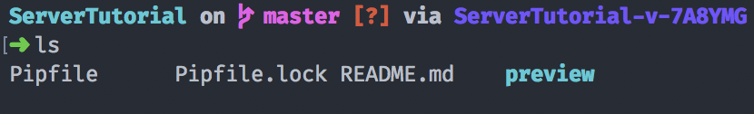
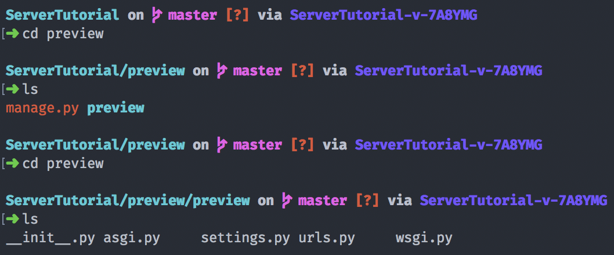

Here's a file tree of what `startproject` gives you for free: 
```                                                   
	preview
	├── manage.py
	└── preview
	    ├── __init__.py
	    ├── asgi.py
	    ├── settings.py
	    ├── urls.py
	    └── wsgi.py
```
It is a little confusing that `startproject` creates a `preview` folder within `preview`. The nested `preview` folder holds the [administrator settings](https://www.webforefront.com/django/configuredjangosettings.html), [url routes](https://www.youtube.com/watch?v=46DeAs2IKxs), and [deployment scripts](https://docs.djangoproject.com/en/3.1/howto/deployment/wsgi/) (`settings.py`, `urls.py`, and `wsgi.py` respectively), while the parent `preview` folder holds the entire project (or webserver). 

5. It is time to create our first app within the `preview` project. I will name it `backend`: `django-admin startapp backend`
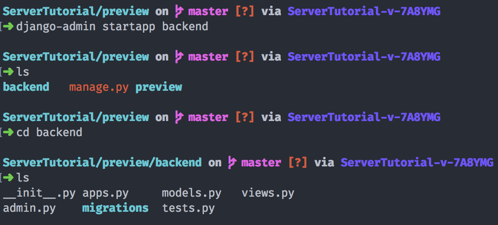

Here is the resulting file structure after running `startproject` and `startapp`
```
preview
├── backend
│   ├── __init__.py
│   ├── admin.py
│   ├── apps.py
│   ├── migrations
│   │   └── __init__.py
│   ├── models.py
│   ├── tests.py
│   └── views.py
├── manage.py
└── preview
    ├── __init__.py
    ├── asgi.py
    ├── settings.py
    ├── urls.py
    └── wsgi.py
```

The new files that get created are stored inside `backend`. The two most important files for our specific workflow are `models.py` and `views.py`. Django [Models](https://docs.djangoproject.com/en/3.1/topics/db/models/) are the underlying data structures used to store various data fields within the server. Models are Python classes that can hold Django [Fields](https://docs.djangoproject.com/en/3.1/ref/models/fields/). [Views](https://docs.djangoproject.com/en/3.1/topics/http/views/) are Python classes that execute their contracts when a specific url is requested from a client.  

*Example Model:* if I wanted to store an image with a linked title, description, and date, I can create an [ImageField](https://docs.djangoproject.com/en/3.1/ref/models/fields/#django.db.models.ImageField), [CharField](https://docs.djangoproject.com/en/3.1/ref/models/fields/#charfield) for the title, [TextField](https://docs.djangoproject.com/en/3.1/ref/models/fields/#textfield) for the description (textfield supports larger strings), and a [DateField](https://docs.djangoproject.com/en/3.1/ref/models/fields/#datefield) for the date. We will have practice with models and fields later on in the tutorial.

### Database Creation and Admin Panel

6. At this point, you can run your server locally with `python3 manage.py runserver`. However, you would get a nasty red message below: 
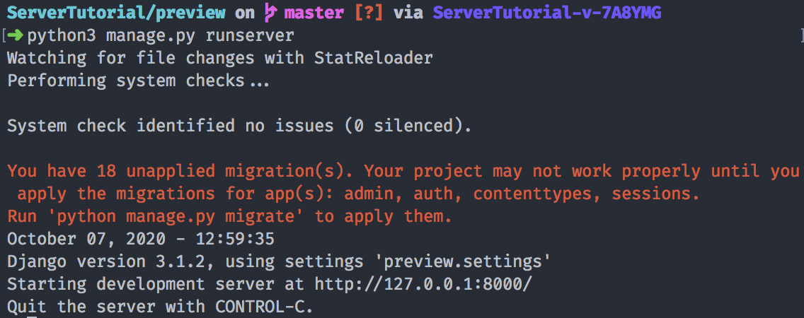

[Migrations](https://realpython.com/django-migrations-a-primer/) are the key to understanding how to modify your server and keep it up to date when testing locally or deploying to a cloud framework. As the error message says, we need to run `python3 manage.py migrate` in order to commit our changes. 

Once a migration is complete, you can view the auto-generated python migrations file within `backend/migrations`. A `db.sqlite3` file also gets generated. This is our server file, and sqlite3 is chosen as our database solution by the default `settings.py` configuration. 

**NOTE:** It is important to look through and learn more about the `settings.py` file, since it dictates how your server operates, what extensions it can use, and a lot more not covered in this tutorial. To get you started, you can navigate to the `DATABASES` line within `settings.py` to notice that our default engine is `django.db.backends.sqlite3` and it gets created within the base directory (our `preview` directory). Another important line within `settings.py` is SECRET_KEY, which developers need to protect when deploying to a production environment or pushing code to GitHub.

If you start the server up again and navigate to `http://localhost:8000` or `http://127.0.0.1:8000` in your favorite browser, you will be greeted with the django startup graphic shown below: 

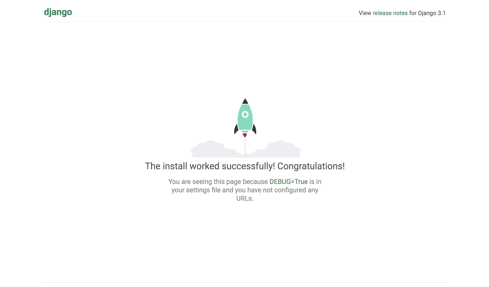

If you check back to the Terminal, you will see our browser (the client) sent 6 GET requests to the local server. Anytime a client sends a request and the server is up, you will get a detailed message of what url was requested, the timestamp, and the status of the request. 

**NOTE:** If you need a refresher on HTTP status codes, [here you go](https://www.w3.org/Protocols/rfc2616/rfc2616-sec10.html). If you have no idea what a client, server, or request is, here's a [starting point](https://en.wikipedia.org/wiki/Client%E2%80%93server_model) 

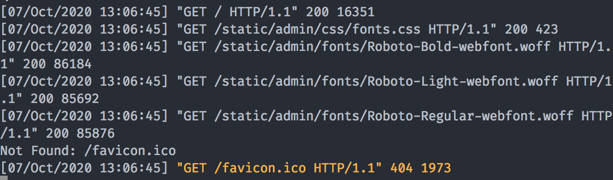

7. It's now time to setup the administrator dashboard and create a superuser for the server: Run `python3 manage.py createsuperuser` and follow the instructions.

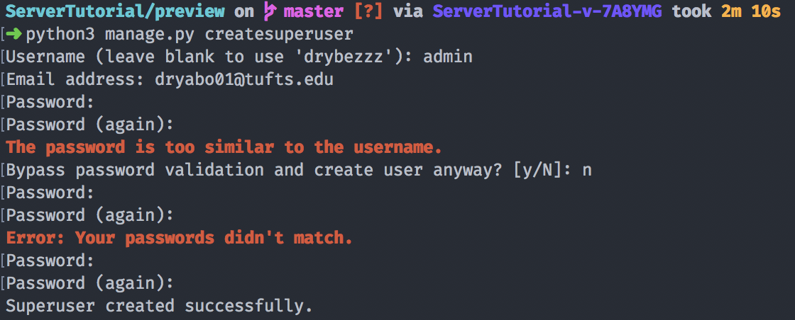

As you can see, django's password tool is robust and has some validation, so don't be worried if you mess up on the first try. 

If you still have the server running, you can now navigate to `http://localhost:8000/admin`, the administrator dashboard url endpoint that django kindly gives us for free. Enter the username and password you just created with the `createsuperuser` command to access the site.

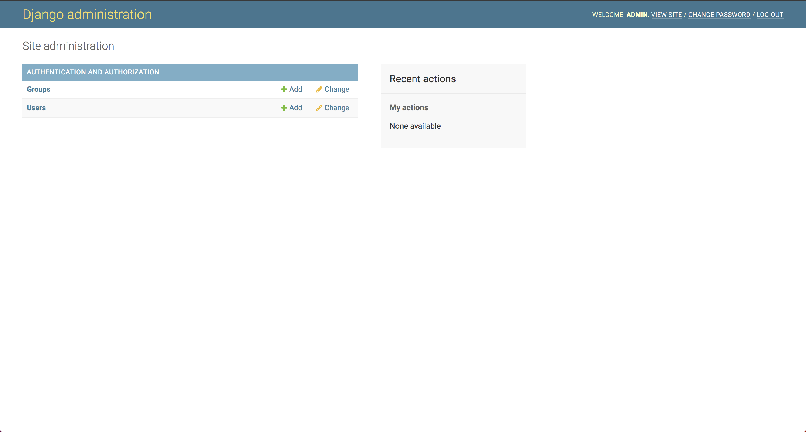

When we initialize a model or add users & extensions, the dashboard gets updated and allows admins to view, modify, and delete data fields. The dashboard also can add, modify, and delete permissions of users, create groups, and [more](https://docs.djangoproject.com/en/3.1/ref/contrib/admin/). 

### Model and Endpoint Workflow
8. Now it's time to create our first django model. Navigate to the `backend` folder and open up `models.py` with your favorite text editor. 

I'm starting with a django tutorial classic: the Todo Model. As an aspiring developer, why not use your own server to organize your project and manage tasks? We can start with this Todo model to show how we can add, modify, and delete Todo tasks within the Django admin site (or with simple HTTP requests, later in the tutorial).

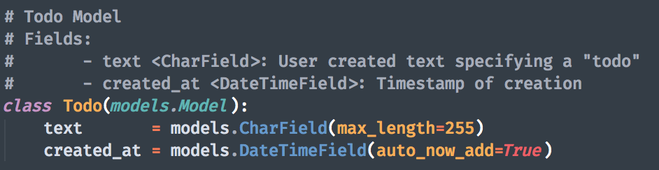 

Here's my Todo Model. It uses a TextField to store the task that a user specifies and generates a timestamp of when the task was created. This Todo Class inherits django's base [model](https://docs.djangoproject.com/en/3.1/ref/models/instances/#django.db.models.Model) class, and you are allowed to customize and overload the base class to help suit your client needs. For this tutorial, we will stick with default model instances.

In order to view this model in the admin dashboard and have the database subscribe to the fields, we have to do a couple things: 
    - Open `admin.py`, add the line: `from .models import *`, and in a new line add `admin.site.register(Todo)`. This registers the Todo model with the admin site. *Remember:* you can always view my files within this repository to double-check your work along the way. 
    - Go to `settings.py` and within the `INSTALLED_APPS` list, add the string `'backend'` (if you named your app `backend` using the `startapp` command).
        - While we're in `settings.py`, we can also add `'rest_framework'` to the list of `INSTALLED_APPS` so the `djangorestframework` extension can be accessed by our server. 

**NOTE:** Any new model that you create *MUST* be registered with the admin site if you want to see the data using the dashboard.

9. In order to communicate with this new model class, we must first create a [serializer](https://www.django-rest-framework.org/api-guide/serializers/)

Let's begin by creating a new file within the `backend` folder called `serializers.py`. Within `serializers.py`, add the TodoSerializer class below: 

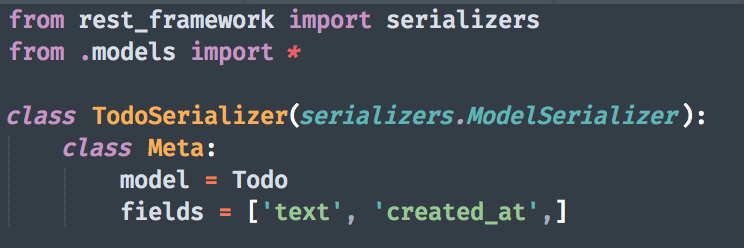

I won't bother explaining why a serializer is useful, all you need to know is that the serializer is the intermediary between JSON, XML, etc. data and the Python objects that you create. More info found in the link above. 

10. Now we create the TodoViewSet, a way for the client to view the data. 

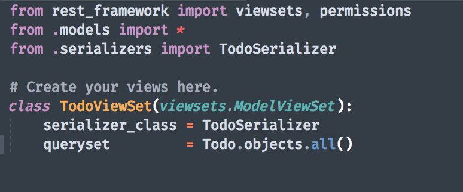

The TodoViewSet binds with the TodoSerializer and sets the default queryset to be all Todo Objects within the server. 

Let's quickly set up our URL endpoints so we can communicate with our Todo model.

### URL Configuration 

11. Add `path('backend/', include('backend.urls')),` to the urlpatterns list within the `preview/urls.py` file. This allows the server to *route* all urls that start with `backend/` to the viewsets (and underlying models) that we have created within the `backend` app. 

**NOTE:** The default `preview/urls.py` gives you `path('admin/', admin.site.urls)`. If you want to dig deeper, `admin.site.urls` holds the url routes required for the client to reach and communicate with the admin dashboard.

12. Since we don't have a `backend/urls.py` yet, we now have to create the file and add the backend url routing. Here is what I came up with: 

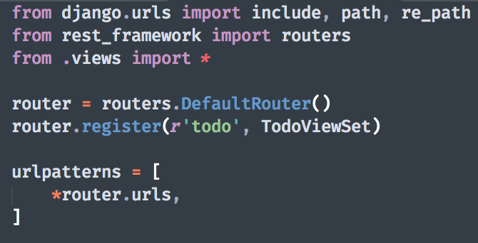

The `DefaultRouter()` that comes with django rest framework helps organize the generated viewsets. You can either use the router or add paths to the `urlpatterns` list, there are use cases for both, not covered in this tutorial. More info [here](https://www.django-rest-framework.org/api-guide/routers/).

### Testing

Now that we have both the server-wide and `backend` app url-routing complete, we can make migrations and test using the Admin Dashboard and simple requests. 

13. Let's start up the server again and navigate to the admin dashboard.

**NOTE:** Don't forget to make migrations any time you add models! Before you start the server again, run `python3 manage.py makemigrations && python3 manage.py migrate` to commit your additions.

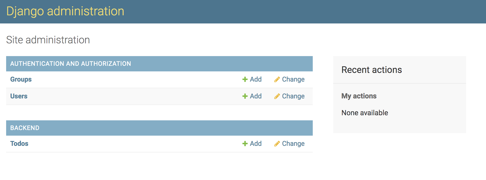

You can see now that there is a new section called `BACKEND` and under it, our `Todo` model! Click on Todo to take you to the model page. 

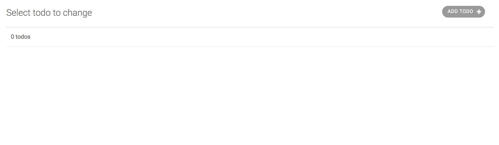

Let's add our first todo by clicking the top right button and typing in some text. I took the liberty to create a couple for us: 

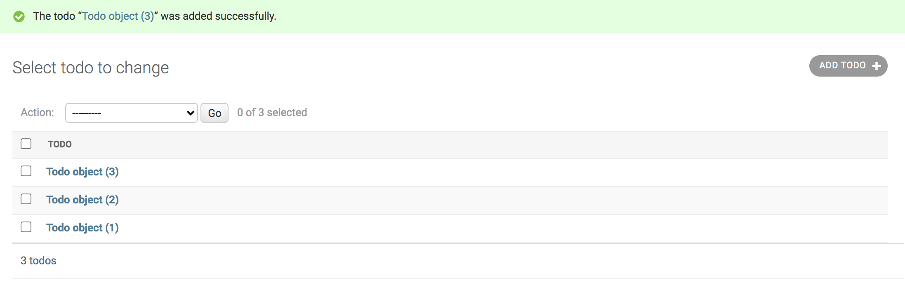

That's weird, I can't really tell what my Task is since `Todo object (#)` isn't really verbose. Let's try and overload the Todo model's `__str__()` method to display something more of use to us. Add the following function to our Todo class: 

```
	def __str__(self): 
		return self.text
```

Let's check the dashboard now: 

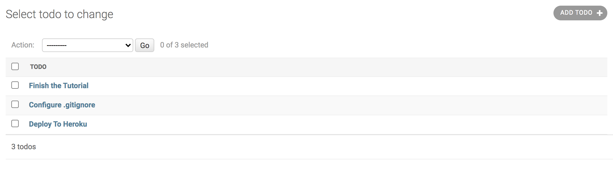

Nice! We can keep on overloading the `__str__` method of django models to help visualize the data within the dashboard. 

Now that we can use the dashboard to add & modify (try and figure out how to delete a Todo with the dashboard) Todos, let's craft a request to the server using the python `requests` library.

14. Head over to the root directory of this project, (above `preview`, where the Pipfile exists) and create a `tests` directory. This way, we can house simple python test scripts that can communicate with the server when it's running. Let's create a file named `test.py` and add these lines: 

```
import requests as r 
import json 

headers = {
    'Content-Type': 'application/json',
    'Accept': 'application/json'
}

res = r.get('http://localhost:8000/backend/todo', headers=headers)

return_dict = json.loads(res.content.decode('utf-8'))

print(json.dumps(return_dict, indent=4))
``` 

This script is crafting a simple GET HTTP request to the `/backend/todo` URL endpoint that we created earlier. This endpoint within `backend/urls.py` communicates with the viewset in `backend/views.py` to execute the response. In this case, django viewsets come with default responses to GET, PUT, POST, & DELETE requests, and our TodoViewSet queryset is defined to return all Todo objects currently residing in the database. 

*Extension:* Since any client that sends a GET request to `/backend/todo` will receive all Todos, a possible extension could be to create a [many-to-one](https://docs.djangoproject.com/en/3.1/topics/db/examples/many_to_one/) relationship with todo tasks and a respective user. I hope to cover user-creation in a later tutorial.

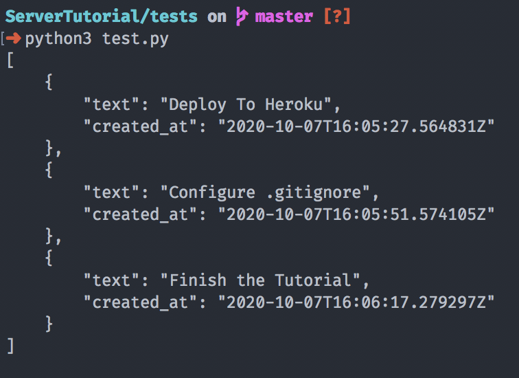

The server responds with a JSON-encoded version of what we saw in the Admin Dashboard. Try to modify the code and use a POST request to add a task. If you get stuck, you can always look at my solution within `tests/test.py`.

My script now outputs: 
```
$ python3 test.py
{
    "text": "Delete this task created by a python script",
    "created_at": "2020-10-07T16:29:06.526742Z"
}
```

Looking at the server logs, I can see the server responded with `[07/Oct/2020 16:29:06] "POST /backend/todo/ HTTP/1.1" 201 97`. A 201 HTTP response represents the server creating data. 

Refreshing the admin dashboard gives us this: 

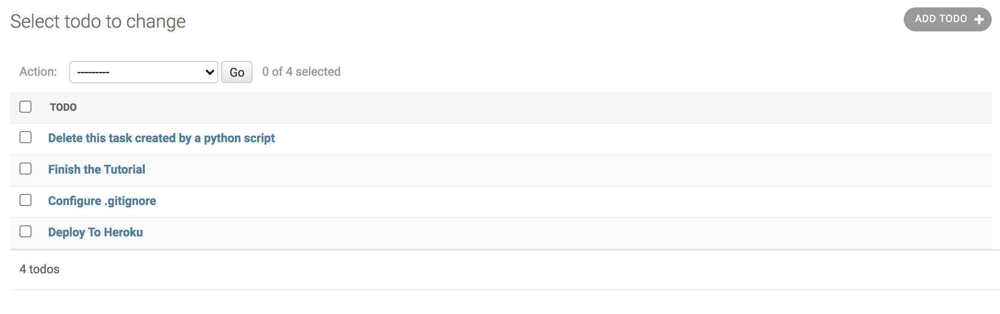

Awesome! We just tested our Todo URL endpoint with the Admin Dashboard and the Python HTTP requests library! 

### Templates

We're going to pivot and write an HTML template our server can host if users are accessing our endpoints through a browser. We can start by visualizing the Todo data. 

**NOTE:** I'll be using [this](https://developer.mozilla.org/en-US/docs/Learn/Server-side/Django/Home_page) tutorial to base my setup, if you have any further questions I recommend taking a look there. *The Mozilla Developer site is a great resource for anything related to developing products for the Internet.*

15. Add the following line to the `preview/urls.py` file: 

`path('', views.index, name='index')`

We have now added a root endpoint for clients that access our site. The resulting viewset and HTML template will be rendered in the browser if you visit `http://localhost:8000/`.

16. Since the global url route is specifying an index method within `backend/views`, we must now create it so it can display our HTML template. Go to `backend/views.py` and add the following boilerplate: 

```
def index(request): 
	context = [e for e in Todo.objects.values()]
	return render(request, 'index.html', context={'tasks': context})
```

This setup will convert all Todo Objects into a list of Python dictionaries that we can now pass in to an HTML file. 

17. Within the `backend` directory, create a folder called `templates`. This directory will house all of our HTML Templates that django can use to render within browsers. 

Inside `backend/templates`, let's create `index.html`: 

```
<!DOCTYPE html>
<html lang="en">
<head>
  <title>Preview Test</title>
</head>
<body>
  
  	<p>{{ task.text }}</p>
  
</body>
</html>
```

The `` syntax represents *template* expressions and variables. The context I am passing in from the `index(request)` method contains a dictionary with one key: `'tasks'`. `'tasks'` contains a list of dictionaries, with each dictionary being a deserialized Todo object. Within the template, we can iterate through this list and gather the tasks to render in the browser window.

Here's a graphic I made to explain in more detail: 

``` 

	Todo.objects.values() ==> Django ValuesQuerySet (almost a python list)
	context = [e for e in Todo.objects.values()] ==> python list of dicts

	Sample Representation: 

	context  =  [{"text": "Deploy To Heroku","created_at": "2020-10-07T16:05:27.564831Z"},...]

	render(....., context = {'tasks': context}) 
			context	==> dict containing 1 key with a value of list of dicts

	Sample Representation: 

	context  =  {'tasks': [{"text": "Deploy To Heroku","created_at": "2020-10-07T16:05:27.564831Z"},...]}

	Now we can access tasks as a template variable within an html template.
```

If we save `index.html` and navigate to `http://localhost:8000`, we will now see this: 

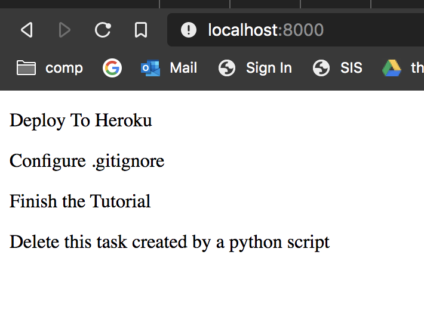

**NOTE:** The server responded with `[07/Oct/2020 17:15:23] "GET / HTTP/1.1" 200 257`. Notice the bare `/` which signifies the root path specified by `path('', views.index, name='index')` within our `preview/urls.py`

Congratulations! You have connected an HTML template to a function-based view.

### Deploying to Heroku 

Now that we are satisfied with our barebones server and website, we can now prep it to be deployed to Heroku. 

If you don't know what Heroku is or haven't created an account, start [here](https://devcenter.heroku.com/articles/git). I will be using [this](https://devcenter.heroku.com/articles/deploying-python) Heroku resource ([django](https://devcenter.heroku.com/categories/working-with-django) resource here) to help guide this part of the walkthrough. I recommend reading the above articles before getting started.

18. Navigate to the root `preview` folder and in the Terminal run: `echo web: gunicorn preview.wsgi > Procfile` (if you don't have Terminal, you can just create the Procfile and add the above line)

This basically tells a Heroku worker that has bound to your application where to start the server. 

19. In the same directory, run `pip3 freeze > requirements.txt` so Heroku knows what dependencies to install before initializing the server. 

**NOTE:** Make sure you are still within a virtual environment when you run `pip3 freeze` or you will send all python libraries installed on your computer to `requirements.txt`!!!

### QUICK SETTINGS FIX 

Let's quickly go back to `preview/settings.py` and add a line anywhere in the settings file: 
```
STATIC_ROOT = './backend/templates/'
```
This will let heroku configure static files to point to that relative file path

Also, locate the `ALLOWED_HOSTS` line and copy your heroku URL into the list. 
Mine will look like this:

```
ALLOWED_HOSTS = ['test-django-server1.herokuapp.com']
```

20. If you have the Heroku CLI installed, within the same directory run `heroku login` and then `heroku create your-app-name`. Please change `your-app-name` to something more suitable, mine will be `test-django-server1`

Within the outer `preview`, run `git init` and `git remote add heroku https://git.heroku.com/your-app-name.git`. Again, change `your-app-name` to your actual app name, the real git link is given to you after running `heroku create`

21. Run `git add *`, `git commit -m 'initial heroku commit'` and `git push heroku master` to then see if the deployment succeeds. Once you navigate to the site, if any errors persist, run `heroku logs --tail` to see the debug statements. The `logs` command also shows all server requests and responses, useful to see if the site is being visited. 

## Congratulations! 

You have successfully created a django server, added a root page for the website, and deployed to Heroku. 

There are a lot of things I didn't cover: things to `.gitignore`, security habits, and finer details on model workflow, but I think this is more than enough to get you started. 

If you have any questions or errors, feel free to create an Issue within this repo. 

Here's the deployed website: 

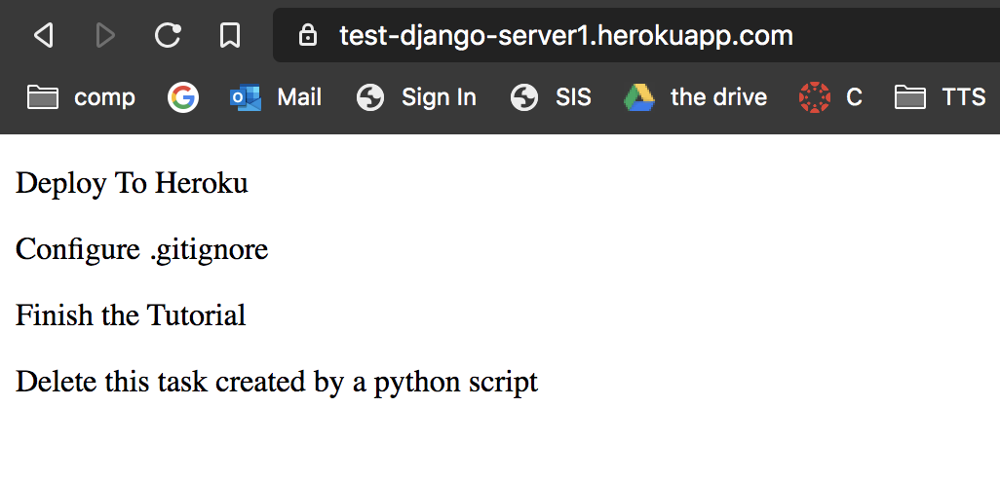

Here's the final file structure: 
```
preview
├── Procfile
├── backend
│   ├── __init__.py
│   ├── admin.py
│   ├── apps.py
│   ├── migrations
│   │   ├── 0001_initial.py
│   │   └── __init__.py
│   ├── models.py
│   ├── serializers.py
│   ├── templates
│   │   └── index.html
│   ├── tests.py
│   ├── urls.py
│   └── views.py
├── db.sqlite3
├── manage.py
├── preview
│   ├── __init__.py
│   ├── asgi.py
│   ├── settings.py
│   ├── urls.py
│   └── wsgi.py
└── requirements.txt
```


